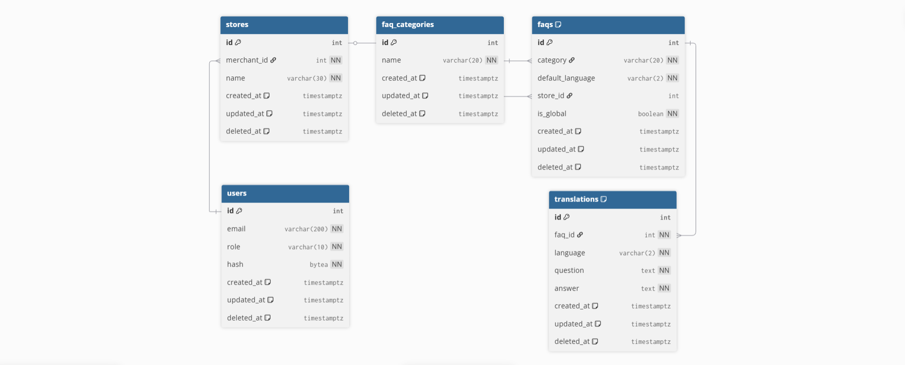

# Yamm FAQ

**Yamm FAQ** is a high-performance backend service built with **Go 1.25** and
**Gin**, designed for multi-tenant FAQ management with native support for
internationalization.

## 📁 Project Structure

The project follows a clean architecture pattern, separating concerns into distinct layers for maintainability and testability.

```Plaintext
.
├── cmd/api                 # Application entry point & Swagger docs
├── docker                  # Dockerfiles for API and Migrations
├── docker-compose.yml      # Orchestration for API & PostgreSQL
├── docs                    # Architecture & design documentation
├── internal
│   ├── config              # Environment and app configuration
│   ├── controllers         # HTTP Handlers & Route definitions
│   ├── httputil            # Common HTTP response helpers
│   ├── models              # Domain entities (FAQ, User, Store, etc.)
│   ├── repositories        # Database abstraction layer (SQL)
│   └── services            # Business logic layer
├── migrations              # SQL migration scripts
├── pkg                     # Shared utilities (JWT, Validation)
└── README.md
```

## 🏗 Database Schema (ERD)



> The schema follows a normalized approach where FAQ content is decoupled from the FAQ metadata to allow for dynamic, multi-language support.

---

## 🧠 Design Decisions & Middleware

Our architectural choices focus on security, developer experience, and system resilience:

### 1. Security & Middleware Stack

The API implements a layered defense strategy using custom middleware:

- **Global Rate Limiting:** `r.Use(rateLimitMiddleware(2, 2, 15*time.Minute))`
  To prevent brute-force attacks and resource exhaustion, we enforce a strict rate limit across all routes. In its current configuration, it allows a burst of **2 requests** with a refill rate and TTL designed to protect sensitive authentication and write endpoints.
- **JWT-Based Authentication:** `auth.Use(c.authMiddleware())`
  Following our decision to use JWTs, this middleware validates the user's JWT before allowing access to administrative or merchant-specific actions.
- **Authorization Gating:** Public endpoints (GET) are accessible via the `api` group, while all destructive or creative actions (POST/PUT/DELETE) are gated behind the `auth` group.

### 2. Internationalization (i18n)

We avoid "schema bloat" by using a dedicated **Translations Table**. Each FAQ record acts as a container, while the actual text (Question/Answer) lives in a related table keyed by language code. This allows for the dynamic addition of languages without database migrations.

### 3. Multi-Tenant Architecture

The system supports both "Global" (Admin-managed) and "Store-specific" (Merchant-managed) FAQs. This is achieved through a nullable `store_id` relationship, ensuring strict data isolation while reusing the same core FAQ logic.

---

## 🚀 Getting Started

### Prerequisites

- **Go:** 1.25+
- **Docker & Docker Compose**

### Running the Application

```bash
# 1. Setup environment
cp .env.example .env

# 2. Start API and Database
docker-compose up --build

```

**Swagger Documentation:** Once running, visit [http://localhost:8080/swagger/index.html](https://www.google.com/search?q=http://localhost:8080/swagger/index.html).

Postman Documentation: postman collection with all the endpoint available on the root directory

---

## 🛠 Complete Endpoint Reference

All endpoints below are prefixed with `/api/v1`.

### 👤 User Authentication

| Method | Endpoint           | Auth | Description                      |
| ------ | ------------------ | ---- | -------------------------------- |
| `POST` | `/signup/customer` | No   | Register a new customer          |
| `POST` | `/signup/merchant` | No   | Register merchant + create store |
| `POST` | `/login`           | No   | Login and receive session cookie |

### 📂 FAQ Categories

| Method   | Endpoint                    | Auth    | Description                  |
| -------- | --------------------------- | ------- | ---------------------------- |
| `GET`    | `/faq-categories`           | No      | List all categories          |
| `POST`   | `/faq-categories`           | **Yes** | Create new category (Admin)  |
| `PUT`    | `/faq-categories/:category` | **Yes** | Update category name (Admin) |
| `DELETE` | `/faq-categories/:category` | **Yes** | Delete category (Admin)      |

### 🌍 Global FAQs

| Method   | Endpoint                        | Auth    | Description                   |
| -------- | ------------------------------- | ------- | ----------------------------- |
| `GET`    | `/faq-categories/:category`     | No      | Get global FAQs in a category |
| `POST`   | `/faq-categories/:category`     | **Yes** | Create global FAQ (Admin)     |
| `PUT`    | `/faq-categories/:category/:id` | **Yes** | Update global FAQ (Admin)     |
| `DELETE` | `/faq-categories/:category/:id` | **Yes** | Delete global FAQ (Admin)     |

### 🏪 Store Specific FAQs

| Method   | Endpoint                   | Auth    | Description                   |
| -------- | -------------------------- | ------- | ----------------------------- |
| `GET`    | `/stores/:id/faqs`         | No      | Get FAQs for a specific store |
| `POST`   | `/stores/:id/faqs`         | **Yes** | Create store FAQ (Merchant)   |
| `PUT`    | `/stores/:id/faqs/:faq-id` | **Yes** | Update store FAQ (Merchant)   |
| `DELETE` | `/stores/:id/faqs/:faq-id` | **Yes** | Delete store FAQ (Merchant)   |

### 🈯 Translations (Global & Store)

| Method   | Endpoint                | Auth    | Description                   |
| -------- | ----------------------- | ------- | ----------------------------- |
| `GET`    | `/.../:id/translations` | No      | List all language versions    |
| `GET`    | `/.../:id/:language`    | No      | Get specific language version |
| `POST`   | `/.../:id/translations` | **Yes** | Add new translation           |
| `PUT`    | `/.../:id/:language`    | **Yes** | Update specific translation   |
| `DELETE` | `/.../:id/:language`    | **Yes** | Delete specific translation   |

### 🏥 System

| Method | Endpoint  | Auth | Description          |
| ------ | --------- | ---- | -------------------- |
| `GET`  | `/health` | No   | Service health check |
